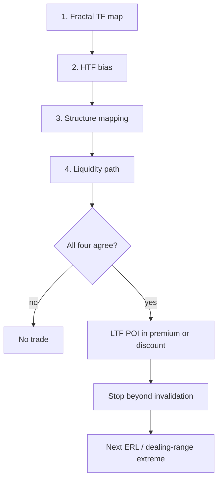
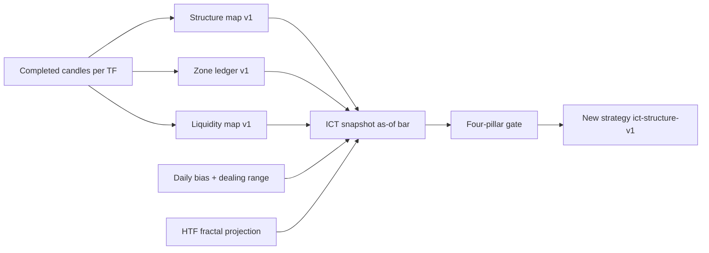

# SMC/ICT methodology → system upgrade

The lectures (Nilesh / “Gwalior”, Bank Nifty SMC → ICT series) teach a **decision stack**, not a list of indicators. The repo already has pieces of that stack, but they are disconnected: `smc-v2` emits one-bar events, confluence only nudges existing strategies by ±10, and the HTF layer is EMA trend + swing S/R that only the backtest CLI populates.

Do **not** mutate [smc-v2](apps/api/src/modules/technical-analysis/domain/technical-indicator.ts). Historical snapshots were look-ahead-purged once (migration 048). New work should be a versioned domain module that *consumes* completed candles and publishes a **state snapshot**, not a new pile of one-shot events.

Two names, deliberately distinct: `ict-state-v1` is the engine version stamped on every snapshot, with a separate hash of its frozen parameters; `ict-structure-v1` is the strategy key registered in `strategy-registry.ts` and pinned by its tests. A state-rule or parameter change can therefore invalidate/recompute snapshots without renaming the strategy when its input contract is unchanged.

## System invariants

These hold across every phase, module, and test. Breaking one is a design error, not a tuning choice.

1. **Point-in-time.** A trade idea may only be generated from an immutable ICT snapshot whose complete required evidence was knowable at the decision instant. No strategy, state machine, loader, decorator, or execution component may infer, repair, backfill, or substitute missing historical state.
2. `**UNKNOWN` is not `NEUTRAL`.** `NEUTRAL` means the engine ran on sufficient evidence and found no directional edge. `UNKNOWN` means the evidence was absent, incomplete, or ambiguous. Coverage (`COMPLETE | NOT_COVERED | UNKNOWN`) is carried separately from value at every level, and the four-pillar gate treats `UNKNOWN` as no-trade rather than as permission. Missing data must never collapse into neutral-and-therefore-tradable.
3. **Prefix invariance.** For any series, the snapshot at bar `i` must be identical whether the engine was fed bars `0..i` or `0..i+n`. This is a property of every ICT state machine, not only the Phase 1 structure map.
4. **Snapshots are immutable.** Identity is instrument + source timeframe + source candle + engine version + config hash + data vintage. A rule or parameter fix never rewrites history; it computes a new version alongside the old so the two can be compared and the older measurements stay interpretable.
5. **The domain does not know execution.** The ICT domain owns structure, zones, session liquidity, bias, dealing range, fractal projection, and snapshot composition. It must not import option pricing, broker, fill, or paper-trading concepts. Execution consumes ICT output strictly downstream, never the reverse.

## Current implementation status

This plan is **not greenfield**. A partial ICT implementation already exists and predates the invariants above, so it has not been audited against them. Read this section before writing any code; the earlier phase text was written as if none of it existed.

**Already exists (committed, unaudited against the invariants):**

- `apps/api/src/modules/technical-analysis/domain/ict/` with `config.ts` (engine version, `IctEngineConfig`, `computeIctConfigHash`, `PillarCoverage`), `causal-pivot.ts`, `structure.ts`, `zones.ts`, `session-levels.ts`, `bias.ts`, `liquidity.ts`, `composite-engine.ts`, and a test file per module. This covers the ground of Phases 1-5.
- `StrategyMarketContext.ictSnapshot` is declared in [strategy.ts](apps/api/src/modules/strategy-engine/domain/strategy.ts).
- `ict-structure-v1` is registered in `strategy-registry.ts` with `["5m","15m"]` and pinned by `strategy-registry.test.ts`, and [ict-structure-strategy.ts](apps/api/src/modules/strategy-engine/domain/ict-structure-strategy.ts) implements a partial four-pillar gate.
- `GenerateTradeIdeas` already exempts `ict-structure-v1` from the legacy SMC wrapper.
- Migration `105-ict-state-snapshots` exists and is registered in `migrations/index.ts`.

**Inert, not at risk.** Nothing populates `context.ictSnapshot` in any production path, so `IctStructureStrategy.evaluate` returns `[]` on its first guard, and ICT is absent from every roster in `bot-sandboxes.ts`. There is no live or paper exposure today, which is why the foundation can be corrected before wiring rather than after.

**Missing, and the real blocker: all of Phase 6 delivery.** No ICT snapshot repository, no compute service or CLI, no scheduler job, and no context loader. `PostgresStrategyMarketContextRepository.assembleContext()` loads indicators, patterns, and regime only.

**Known conformance defects in the existing code**, to be fixed in Phase 0.5 rather than inherited:

- `composite-engine.ts` maps `NEUTRAL` structure and `NEUTRAL` bias to coverage `UNKNOWN`, which is precisely the collapse invariant 2 forbids; it also hardcodes `zones: "COMPLETE"` regardless of evidence, and reports `liquidity: "NOT_COVERED"` whenever no target exists even when the engine ran on complete inputs.
- Zone ids are index-derived (`fvg-bullish-${currentIndex}`), so they are not stable across replay windows and cannot satisfy the Phase 2 identity rule or Phase 7 evidence references.
- Migration 105's unique key is `(instrument_id, timeframe, bar_time, engine_version, config_hash)` with no `source_candle_id`, `known_at`, or data vintage, so it cannot express invariant 4.
- `IctStructureStrategy` never gates on `coverage.htf`, has no ranked POI selection, no displacement requirement, and no LTF CHoCH confirmation, omits `ictSnapshotId` from its evidence, and hardcodes expiry as `expiryCandles * 5 * 60_000`, which is wrong on the 15m timeframe it claims to support.

`docs/SMC_ICT_Upgrade.md` is an earlier divergent copy that lacks the invariants, the identity rules, and the Phase 6 split. This plan file is the single source of truth; reconcile or delete that copy rather than reading both.

## What the lectures actually teach

Four pillars, all required (Lecture 11). Missing any one is a no-trade:

**Fractal (L2, L8, L11):** HTF defines the objective; LTF executes. Indian stack: Weekly/Daily POI → 4H/1H location → 15m/5m (1m refine). Do not remap ITH/ITL independently on 1m/5m. HTF STL ≈ LTF ITL (bullish); HTF STH ≈ LTF ITH.

**Structure (L3, L8):** BOS = continuation (break prior HH in uptrend / LL in downtrend). CHoCH = trend change (break HL / LH). **Body close** confirms BOS/CHoCH; wick-only is a sweep. **IDM** (inducement) is the nearest *left-side* internal swing; wick/tap is enough; it confirms the HH/LL. Search for entries only in **IDM → prior HL/LH**, never between IDM and the extreme. Indian gaps = one candle; merge inside-bars before counting.

**Liquidity (L5, L11):** External (ERL) = PDH/PDL, swing H/L, equal H/L. Internal (IRL) = traps inside the HTF range. Price deals with IRL before taking ERL. Trend-aligned PDH/PDL: uptrend + PDL grab → target PDH; uptrend + PDH grab → only leftover LTF POIs, then resume up (mirror for downtrend).

**POIs ranked (L6):** (1) IDM sweep with no remaining OBs, (2) first OB after IDM, (3) extreme OB at CHoCH, (4) BOS sweep, (5) CHoCH sweep. Skip mid-range OBs. Require displacement (FVG / volume imbalance / gap void) before trusting a bounce.

**Blocks (L4, L7):** Basic OB = last opposing candle **with FVG**. Advanced OB can drop the FVG requirement. Mean threshold = 50%. Wick overlapping unfilled FVG → use overlap zone, not full OB. Later: mitigation (one-side swing fail), breaker (both BSL and SSL taken), rejection (wick zone; body through 50% = invalid), reclaim (left-side OBs at HTF POI).

**Bias (L9):** Daily/Weekly/Monthly OHLC Judas (bearish OHLC / bullish OLHC). Next-day bias from prior-day liquidity grab + close. Dealing range after both SSL and BSL hunted; buy discount / sell premium around 0.5.

**Indian session (do use):** 09:15–15:30 IST cash, 15:40 derivatives ([trading-session.ts](apps/api/src/modules/platform/calendar/trading-session.ts)), PDH/PDL every cash day, gap = one candle, option premium decay → prefer same-day management.

**Timeframe reality check (verified):** `supportedHistoricalTimeframes = ["1m","3m","5m","10m","15m","30m","60m","1d"]`. There is **no `4h`**, and `1h` is explicitly not a member — only stray seed rows ever carried it (see the ladder comment in `postgres-trade-review-repository.ts`). The lectures' 4H structure TF therefore has no direct home: the NSE cash session is 6h15m, so a true multi-day 4H bar would have to straddle sessions, which [higher-timeframe-resolver.ts](apps/api/src/modules/strategy-engine/domain/higher-timeframe-resolver.ts) deliberately refuses ("an overnight gap is not sixty minutes of trade"). **Resolved in Phase 0**: the v1 HTF stack is `1d` + `60m` + `30m`, and multi-session 4H bucketing is out of scope. The resolver's current defaults are `15m` + `60m`; v1 must explicitly replace that default for ICT and add a stored-`1d` provider. Do not silently relabel a 4-bar 60m bucket as "4H".

**Forex timing (do not use on NSE cash):** Killzones (Asian 20:00–00:00 UTC−4, London 02:00–05:00, NY 07:00–12:00), CBDR 14:00–20:00 × 4 SD boxes, Asian 15:30–20:00 pre-range. Keep as a later optional layer for gold / overnight futures only. OTE fibs (0.62 / 0.70 / 0.79) can be reused as an entry *refinement* inside an already-valid Indian dealing range.

Lecturer “probabilities” (80–95%) are heuristics. Code them as ranked filters, never as calibrated P(win).

## Current system vs lectures

- **FVG:** [fvg()](apps/api/src/modules/technical-analysis/domain/technical-indicator-engine.ts) detects the three-bar event, but has no inside-bar merge, fill/CE/inversion lifecycle, and sets `active: true` as a stub.
- **BOS/CHoCH:** body-close detectors use the last confirmed pivot, but there is no IDM, internal/external distinction, or HH/HL confirmation chain.
- **Liquidity:** `liquiditySweep()` and [SweepReclaimEngine](apps/api/src/modules/pattern-intelligence/domain/engines/sweep-reclaim-engine.ts) detect generic swing sweeps. `detect-pattern-intelligence.ts` now does resolve and pass `referenceLevels`, so `PDH_SWEEP`/`PDL_SWEEP` are no longer dead; the remaining defect is that one static level set is passed to every bar of a multi-day window. There is no ERL/IRL map or objective matrix.
- **Order blocks and equilibrium:** the current engine finds a last opposing candle and a swing midpoint, not FVG-attached carried zones or a causal displacement dealing range.
- **Fractal MTF:** [higher-timeframe-resolver.ts](apps/api/src/modules/strategy-engine/domain/higher-timeframe-resolver.ts) exists and is tested, but only the opt-in backtest flag uses it. Live and scan contexts leave `higherTimeframes` undefined. Its current output is EMA9/21 bias + swing S/R with no nested ICT state.
- **Bias and POI ranking:** neither exists. Current confluence weights one-bar SMC evidence rather than applying the lecture ranking.
- **Zone lifecycle:** explicitly not modelled; [smc-confluence.ts](apps/api/src/modules/strategy-engine/domain/smc-confluence.ts) calls this out.
- **Strategy role:** SMC cannot create an idea; it only adjusts an existing proposal by at most ±10.

Stock Intelligence (6M/12M analogue outlook) is a different product. Do not fold Bank Nifty intraday SMC into it. Exposing Daily/Weekly structure or PDH/PDL as M01 catalog features is a separate future proposal, out of scope here.

## Target architecture

One **as-of snapshot per instrument × timeframe × closed bar**, PIT-safe. Its decision instant is the source candle's close for replay/computability and the actual evaluation wall clock for live operation. An HTF candle with `closeTime <= decisionAt` is visible, including a 30m/60m candle closing at the same instant as the source candle; a later close is not. The current session's unfinished daily candle is never visible. Store coverage per pillar (`structure`, `zones`, `sessionLevels`, `bias`, `liquidity`, `htf`) so any missing or unknown input fails the four-pillar gate closed.

## Implementation phases

### Phase 0 — Data and rule-definition gates

**Phase 0 is a hard blocker, not documentation.** No Phase 1 or later implementation may begin until every rule below is frozen in a versioned definitions module with fixtures and a config hash. Treat Phase 0 as the compiler boundary for the methodology: the dominant risk on this project is not coding, it is coding an ambiguous trading concept and only discovering later that the backtest depended on an undocumented interpretation. A rule frozen after the fact invalidates every measurement taken under it.

Rules that must be frozen before any detector is written:

- IDM valid and invalid fixtures: the exact v1 subset chosen from L3's six/six examples, with every unselected case listed explicitly as deferred.
- Inside-bar merge and Indian gap-as-one-candle.
- Three-candle FVG indexing.
- Strong close.
- Displacement.
- BSL/SSL hunt semantics, including the tie case where both pools are taken inside one candle and the intrabar path is unknowable.
- Zone lifecycle transitions, defined independently for FVG and OB.
- FVG inversion, consequent encroachment (CE as the midpoint) and fill-percentage semantics, and OB consumption.
- Dealing-range selection and replacement, including the tie case above where no causal ordering exists.
- The false-wick-CHoCH metric, which is currently named in the acceptance criteria with no formula.
- Maximum signal age and maximum source-close-to-execution underlying drift. Both already have values in `ict/config.ts` (`maxSignalAgeBars: 3`, `maxUnderlyingDriftBps: 25`); Phase 0 ratifies or replaces them rather than inventing them.
- Ranked POI ordering with explicit tie-breaks, and the HTF POI tap that Phase 7 gates on. Neither exists in code today.
- `pullbackEndKnown` as a **contract only**: its inputs, its tri-state (`true | false | unknown`), and its blocking semantics, tested against mocked structure and zone inputs. Its evaluator legitimately depends on Phase 1 and Phase 2 output, so the wiring lands in 6B; only the contract is a Phase 0 blocker. Freezing the contract is what prevents the evaluator from being designed backwards from whatever makes a trade appear.

MSS is omitted from v1 because neither the lecture summary nor the repository defines a separate contract for it. Auto-caption heuristics are not implementation specifications.

Three contracts must be frozen alongside the rules, because Phase 7 already gates on them and none is currently written down:

- **Four pillars mapped onto the six coverage fields.** The lectures give four pillars; `PillarCoverage` in `ict/config.ts` has six fields. Freeze the mapping explicitly: fractal maps to `htf`, bias to `bias`, structure to `structure`, and liquidity to `sessionLevels` plus `liquidity`, with `zones` as the POI substrate that gates entry without being a lecture pillar. Then freeze the **alignment truth table**: what direction agreement means across bias, structure, and liquidity, which premium/discount location is required, and which coverage value each pillar must hold to count as known. The existing strategy checks four of the six fields and ignores `htf` entirely, so this mapping is a correctness fix and not documentation.
- **One canonical identity block.** Distinguish three things that the plan currently blurs: the **natural key** that makes a snapshot immutable (instrument, source timeframe, source candle id and time, engine version, config hash, data vintage), the **provenance** fields that are mode-specific and excluded from any parity hash (`knownAt`, `received_at`), and the **surrogate** `ictSnapshotId` that ideas and evidence reference. State which of the three each consumer uses.
- **An evidence-id scheme per pillar.** Phase 2 specifies `zoneId` in detail while structure, liquidity, bias, and HTF events have no id rules, yet Phase 7 requires ids from all of them and the verification section requires those ids to resolve. Freeze a namespace per pillar and the inputs each id hashes.

Also required before implementation:

- Run `npm run data:audit -- --json` from the workspace root and extract BANKNIFTY/NIFTY `1d`, `5m`, and `15m` coverage, provider consistency, first/last close, and completeness. This command audits every series and persists the report; it has no per-symbol filter. Stored `30m`/`60m` are validation comparators, not v1 inputs. Separately run the candle-gap/session-grid check for `5m` across the intended replay window: aggregate completeness cannot prove that every expected bucket is aligned and free of interior holes. Record the minimum warmup bars and usable date range for every timeframe.
- Choose `1d → 60m/30m → 15m/5m` for NSE cash v1. Multi-session 4H aggregation is explicitly out of v1.
- Pre-register promotion criteria before replay: minimum settled signals and paper trades, positive net expectancy after costs, drawdown limit, acceptable data/coverage fraction, and the confidence-interval rule used to reject noise. Keep index-thesis results separate from option-premium execution results.
- Keep state in memory **inside the replay/snapshot builder**, never inside a strategy instance: live idea generation creates a fresh strategy and evaluates one context, so strategy-local memory cannot carry zones. Before enabling the live strategy, persist one composite versioned ICT snapshot per source bar and load it into the context.

**Done when:** the coverage report and 5m grid audit identify an explicit usable window; every rule in the freeze list has fixtures and a config hash; the pillar-to-coverage mapping, alignment truth table, identity block, and evidence-id scheme are written down; all deferred lecture cases are listed; and the promotion protocol is recorded before any replay result is seen.

### Phase 0.5 — Reconcile the existing ICT code with the frozen contracts

The code listed under "Current implementation status" was written before these invariants existed. Audit it against the Phase 0 output and fix what diverges. Do not start Phase 6 delivery until this is green, because every defect here would otherwise be baked into persisted snapshots and become expensive to unwind.

- **Coverage semantics in `composite-engine.ts` (invariant 2 violation).** Separate the value from the coverage: a `NEUTRAL` structure trend or bias with sufficient input is `COMPLETE` coverage carrying a `NEUTRAL` value, not `UNKNOWN`. Replace the hardcoded `zones: "COMPLETE"` with real evidence-based coverage, and stop reporting `liquidity: "NOT_COVERED"` merely because no target was found when the resolver ran on complete inputs. Then state and test how the gate treats `NOT_COVERED`, which the invariants currently leave implicit.
- **Structure trend needs a fourth state.** `IctStructureSnapshot.trend` has no `UNKNOWN`, so insufficient pivots are indistinguishable from evaluated chop. Add it with fixtures for both, otherwise the coverage fix above has nothing truthful to read.
- **Zone identity.** Replace index-derived ids with the deterministic identity frozen in Phase 2 so ids survive a different replay window and can be referenced as evidence.
- **Snapshot table.** Add a **new forward migration** that carries `source_candle_id`, `known_at`, and data vintage, and reshapes the unique constraint to the frozen natural key. Do not edit `105-ict-state-snapshots` in place; it may already be applied. This must land before the 6B writer exists.
- **Strategy gate.** Fix the timeframe-dependent expiry (currently `expiryCandles * 5 * 60_000`, wrong for 15m), add the `coverage.htf` check, and align the pillar checks with the frozen truth table. Ranked POI, displacement, LTF CHoCH, and `ictSnapshotId` evidence remain Phase 7 work.
- **Config ratification.** `ict/config.ts` already carries `pivotLength`, `equalHighLowTolerancePct`, `strongCloseThresholdFraction`, `obMeanThresholdFraction`, and the two tolerances. Confirm each against the Phase 0 fixtures; any value that changes alters the config hash and therefore starts a new snapshot generation, which is the intended behaviour rather than a problem.

**Done when:** every existing `ict/` module passes the Phase 0 fixtures, no code path maps a known-but-directionless value to `UNKNOWN`, zone ids are replay-stable, the corrected snapshot schema is migrated forward, and the strategy's gate matches the frozen alignment table.

### Phase 1 — Canonical structure map (highest leverage)

**This module already exists** at `apps/api/src/modules/technical-analysis/domain/ict/` with `structure.ts`, `causal-pivot.ts`, and tests, so Phase 1 is now an audit against the frozen fixtures rather than new construction. The two known defects, the missing `UNKNOWN` trend state and coverage semantics, are fixed in Phase 0.5. Everything below is the contract the existing code must be proven against; write new code only where a rule is absent or provably wrong.

**Do not casually route this through `pattern-intelligence` instead.** That module enforces an Implementation Gate: `assertDefinitionRegistrable` requires a `pattern-intelligence.<slug>` id, non-empty `parameters`, and non-empty `invalidationConditions`, and `pattern-definition-registry.test.ts` pins every `definitionHash`, so definitions must be frozen *before* the detector is written. Choosing that home is fine, but it is a process commitment, not a folder preference.

Pure functions + tests from lecture rules:

- Inside-bar merge and Indian gap-as-one-candle.
- Valid IDM swing: Phase 0 must enumerate the exact strict v1 fixtures selected from L3's six valid/six invalid examples; defer every unselected case explicitly rather than leaving “strict subset” open-ended.
- Confirm HH only after left-side IDM; confirm HL only after BOS; CHoCH only on the confirmed HL/LH (never right-side / never IDM).
- Publish: `{ trend, lastHH, lastHL, lastLL, lastLH, idm, bosLevel, chochLevel, internalVsExternal }`.

Reuse the **timing rule**, not the function directly: `swingConfirmedAt` is file-private and not exported. Extract a shared causal-pivot utility or implement the rule in the new module, with prefix-invariance tests proving a pivot at `i` is unavailable before `i + pivotLength`.

**Done when:** all frozen structure fixtures pass, every published pivot carries its confirmation bar/time, and prefix-invariance proves no earlier snapshot changes when later candles are appended.

### Phase 2 — Zone ledger (FVG + OB lifecycle)

Replace “emit on creation bar, forget” with a carried ledger:

- Every zone gets an **immutable identity** assigned at creation and never reassigned: `zoneId` (deterministically derived, not random, so replay reproduces it), instrument, timeframe, kind (`FVG` or `OB`), direction, origin candle id and open/close time, creation geometry, `createdAt`, engine version, and config hash. An FVG created at 10:15 and another at 10:25 are different objects even when their price ranges overlap; without stable ids, lifecycle replay and Phase 7 evidence references cannot be reconstructed. Mutable fields (fill fraction, current state) are keyed to that id, never merged into it.
- FVG: create (merge insides), track fill %, CE (mid), invert when closed through against origin.
- Basic OB: last opposing candle **in IDM→HL/LH range** that still has an attached unfilled FVG. Keep only IDM-adjacent and extreme OB.
- Do not overload one enum across FVG and OB. Model explicit lifecycle events such as `CREATED`, `TOUCHED`, `PARTIALLY_FILLED`, `CONSUMED`, `INVALIDATED`, and `INVERTED`; derive current state from events. Reserve `MITIGATION_BLOCK` for the different Phase 8 setup.
- Define FVG and OB invalidation independently. An OB’s 50% mean threshold is its own geometry and does **not** depend on Phase 4’s dealing-range equilibrium, even though both happen to use 0.5.
- This is what [smc-confluence.ts](apps/api/src/modules/strategy-engine/domain/smc-confluence.ts) already says is missing.

The current `IndicatorPoint` / `indicator_snapshots` model is a poor fit for multiple carried zones. Start with a pure state machine returning one composite `IctSnapshot` per bar. Domain lifecycle events drive state transitions; v1 persists the resulting active state plus transitions for that source bar inside the Phase 6 snapshot rather than adding a separate event table. Key snapshots by instrument, timeframe, source candle, algorithm/config version, and data-vintage/known-at metadata.

Carry coverage separately (`COMPLETE | NOT_COVERED | UNKNOWN`) so a strategy can distinguish “the engine ran and found no active zone” from “ICT state was never computed.” This repository already enforces that distinction for Pattern Intelligence; repeating the old zero-row ambiguity would make the four-pillar gate unsafe.

**Done when:** deterministic create/touch/fill/invert/invalidate fixtures pass for bullish and bearish zones, replaying the event sequence reproduces the snapshot, `zoneId` is stable across recomputation and distinguishes overlapping same-direction zones with different origins, and empty-complete differs from not-covered.

### Phase 3 — PIT-safe session reference levels

`detect-pattern-intelligence.ts` now resolves and passes `referenceLevels`, so the `PDH_SWEEP`/`PDL_SWEEP` and `GAP_STRUCTURE` families are reachable. The remaining defect is the one that matters: it resolves **one static level set** and hands the same object to every bar, so a multi-day run applies one day's PDH/PDL across every session transition and contaminates backfills. `ict/session-levels.ts` already tracks levels per session, so this phase is largely about making Pattern Intelligence consume the same causal resolver rather than its own snapshot value.

This phase owns one shared, causal session-level and hunt resolver used by both ICT snapshots and Pattern Intelligence. Change the PI input contract to resolve levels **per IST session** (a date-keyed map or a causal resolver rather than a single object), then:

- Resolve PDH/PDL/PDC from the immediately preceding actual trading session, not calendar yesterday.
- Ensure each intraday bar sees only levels known before its open.
- Do not rely on `PostgresCandleRepository.listCompleted()` alone for live visibility: it filters `is_complete = TRUE` but not `close_time <= asOf`, while other strategy code documents that historical imports can mark a still-open bar complete. The session-level reader needs an explicit as-of cutoff.
- Pass the session-specific levels to sweep, gap, and level-interaction detection.
- Publish causal BSL/SSL hunt events for Phase 4, with wick/body and reclaim semantics frozen in Phase 0.
- Add causal multi-session tests, including weekends/holidays and cash versus derivatives close.
- Keep equal-high/equal-low pool detection inside ICT Phase 5. Reuse the Pattern Intelligence logic only as a reference after making the 0.05% tolerance an explicit frozen parameter; do not make the ICT gate depend on PI observations that `PostgresStrategyMarketContextRepository` does not load.

**Done when:** a multi-session fixture with changing PDH/PDL/PDC, weekends/holidays, and a non-regular session produces correct per-bar levels and hunts; no future-complete candle is visible; the PI CLI emits the previously unreachable families without applying one static level set across days.

### Phase 4 — Indian period bias + dealing range

- Derive a **daily-period path** from complete, session-aligned `5m` bars. A stored daily OHLC row cannot reveal whether the high or low occurred first, so it cannot by itself classify OHLC versus OLHC. Cross-check the derived session OHLC against stored `1d`; if either source is incomplete or differs beyond the frozen tick tolerance, publish `UNKNOWN` rather than choosing whichever source favors the setup.
- Prior session `N`: if it swept session `N-1` PDL and then met the versioned “strong close” rule, session `N+1` may carry bullish bias toward `N` PDH (mirror bearish). Freeze the close-location threshold and all neutral/ambiguous outcomes in configuration before testing.
- Build the dealing range from Phase 1 structure and Phase 3 session liquidity only after both BSL and SSL hunts are causally known. Freeze hunt ordering, wick/body semantics, displacement threshold, and range replacement rules.
- EQ is 0.5 of that displacement range; it is not the existing `EQUILIBRIUM_ZONE`, and it is not an OB’s mean threshold.
- Publish `BULLISH | BEARISH | NEUTRAL | UNKNOWN` plus reason codes. Missing history or ambiguous path must be `UNKNOWN`, never silently neutral.

**Done when:** high-before-low, low-before-high, ambiguous ordering, missing-session, and daily/intraday mismatch fixtures all return the expected bias and dealing range with evidence references.

### Phase 5 — Liquidity objectives

- Classify ERL/IRL only now, because this classification is relative to the Phase 4 dealing range.
- Combine session PDH/PDL/PDC, external structure swings, and parameterized equal-high/equal-low pools.
- Encode the Lecture 5 trend-aligned objective matrix as a pure table: for example, HTF uptrend + PDL sweep can target PDH; HTF uptrend + PDH sweep permits only a counter-move to remaining internal POIs.
- Output an explicit target level, target type, invalidation, and evidence references; “leftover POIs” must be a defined ordered set rather than prose.

**Done when:** the frozen trend/sweep objective matrix passes in both directions, equal-pool tolerance is versioned, and missing range or pool coverage produces no target rather than a neutral target.

### Phase 6 — Fractal HTF projection and context wiring

This is the highest-risk engineering phase because it joins historical aggregation, state persistence, live scheduling, replay, and strategy context in one place. Ship it as five sequential milestones, each independently testable, rather than one merge. Do not start a later milestone before its predecessor's tests are green.

Extend the existing resolver rather than writing an unrelated second aggregator. The comment in [strategy.ts](apps/api/src/modules/strategy-engine/domain/strategy.ts) saying no resolver exists is stale. Its session separation is useful, but its timing contract needs correction: [BacktestEngine](apps/api/src/modules/backtesting/domain/backtest-engine.ts) declares that a signal becomes known at the source candle close, while the resolver publishes a bucket only to the *next* base bar. For ICT, attach every HTF bucket whose `closeTime <= sourceCandle.closeTime`; this permits a 60m bucket closing at the same instant and still excludes an unclosed bucket.

**6A — MTF data construction.** No persistence, no strategy wiring; pure aggregation correctness.

- Fix bucket identity before reuse: `higher-timeframe-resolver.ts` already keys sessions by `istSessionDate()` and discards a bucket that would straddle a session, so the session split is sound. The defect is that a bucket anchors to whichever bar appears first in the session and counts bars from there, so a missing interior `5m` cell silently shifts the whole grid. Anchor buckets to the session grid from `trading-session.ts` / `NseMarketSession`, including non-regular sessions, and fail closed when missing base bars would move a boundary.
- Use one explicit source policy in both live and replay: build ICT `30m`/`60m` from canonical complete `5m` bars anchored to the resolved session; read prior completed `1d` directly and validate its OHLC against the complete intraday session. Replace the resolver's ICT defaults (`15m`/`60m`) with `30m`/`60m`; do not change defaults for incumbent strategies. Never mix provider-aligned stored `60m` in one path with 12×5m aggregation in the other.
- Execution structure uses its own source series: stored canonical `5m` for a 5m strategy and stored canonical `15m` for a 15m strategy. Both receive the same derived `30m`/`60m` and stored-prior-`1d` projections. Enforce the base timeframe in APIs so `barsPerBucket` cannot accidentally mean twelve 15m bars.
- Keep the legacy EMA/SR `HigherTimeframeContext` stable for existing strategies. Add an optional parallel `ictSnapshot`/`ictHigherTimeframes` field so a new feature cannot silently change frozen incumbents.

**6B — Snapshot composition and persistence.** Compose Phases 1-5 plus 6A into one row per source bar and store it immutably.

- `ict_state_snapshots` already exists via migration `105`, corrected by the new forward migration in Phase 0.5. What is missing is everything that uses it: the domain repository contract, the Postgres repository, and the compute application service plus its CLI.
- Key rows by instrument + source timeframe + source candle + engine version + config hash + data vintage, per invariant 4. Writes are insert-only for a new identity; a rule fix computes a new config-hash generation beside the old rather than updating rows in place. Recompute paths must therefore be additive and comparable.
- A 15m/5m execution snapshot carries `htfPoi`, `tradeLocation`, `htfTrend`, and `pullbackEndKnown`, plus per-pillar coverage. Phase 0 must define `pullbackEndKnown` from confirmed Phase 1 structure and Phase 2 zone state; it cannot depend on Phase 8 ITH/ITL. Block entry when it is unknown. Do not independently remap ITH/ITL on 1m.
- Live snapshots use wall-clock `knownAt`; historical backtests compute from cutoff-visible candles instead of pretending a backfilled row existed in real time.

**6C — Context integration.** Deliver stored snapshots into every evaluation path identically.

- Add a shared history/decorator service for live, scan, and backtest paths. `findLatestCompleted()` returns only one context, but the resolver and ICT state machines require history; simply “calling the resolver” there would produce no useful HTF state.
- Fetch a warmup runway before a backtest’s evaluation window. `PostgresBacktestMarketDataRepository` currently starts exactly at `dataWindowStart`, so EMA/structure state otherwise starts cold and differs by arbitrary test-window boundary.
- Preserve `received_at <= dataCutoffAt` and derived-evidence visibility. Filter persisted snapshots by their own `known_at`/calculated vintage as well.
- Load ICT state in `PostgresStrategyMarketContextRepository` and wire the same builder/encoding through `GenerateTradeIdeas`, the paper bot, and backtest. Keep the autonomous agent and `autonomous-v2` adapter (`higherTimeframeCoverage: "NOT_LOADED"` today) out until the paper strategy passes acceptance.

**6D — Live readiness.** Make the runtime refuse to trade on absent or stale state.

- Do not rely on cron offsets for readiness. The scheduler currently launches minute collection and the five-minute paper bot independently. Compute ICT after source bars commit, and make the bot require an exact snapshot for the evaluated source candle with `knownAt <= evaluationTime`; report `ICT_STATE_NOT_READY` rather than carrying a stale snapshot forward. Add the job's claim timeout, liveness expectation, and ordering/readiness tests.
- Fix the paper bot's freshness lookup to require `close_time <= now`; its context repository already has this guard, but the preliminary freshness query does not and can bless a future-dated imported bar.

**6E — Replay/live parity.** Prove the two modes are the same computation.

- Existing `run-backtest.ts --higher-timeframes` is opt-in and decorates only the replay path. Make ICT context attachment explicit and identical in live and replay, then test parity as a gate on this phase, not as a later nice-to-have.

**Done when:** each milestone's tests are green in order, and end to end: live, scan, and replay produce identical domain state/evidence hashes from the same visible candles (excluding mode-specific `knownAt` provenance); same-close HTF buckets are visible but later buckets are not; missing 5m grid cells yield `UNKNOWN`; cold-window and warmed-window overlap is identical; a config-hash change produces a new snapshot generation instead of mutating rows; and the paper bot refuses stale, future-dated, or mismatched source snapshots.

### Phase 7 — Strategy that is allowed to create ideas

[ict-structure-strategy.ts](apps/api/src/modules/strategy-engine/domain/ict-structure-strategy.ts) already exists and is registered, so this phase completes a partial implementation. What it has today: a coverage check on four of six pillars, a bias/structure direction match, a liquidity alignment check, a primary target, and a loose POI-reaction check that accepts any touched OB or partially filled FVG. What it is missing is listed below; the timeframe-expiry and `coverage.htf` defects are fixed earlier in Phase 0.5 so this phase starts from a correct gate.

- Gate: all four pillars known and aligned per the Phase 0 truth table, plus ranked POI + LTF CHoCH after HTF POI tap + causal displacement (`FVG` or session gap/void for INDEX). Ranked POI, displacement, and the CHoCH confirmation do not exist in the current code; the present "any touched zone" check is not the lecture ranking and must be replaced, not extended.
- **Signal identity.** Every emitted idea carries the provenance needed to explain itself later without recomputing market state: the `ictSnapshotId` it read, plus the specific structure, zone, liquidity, bias, and HTF evidence ids it actually used (zone references use the Phase 2 immutable `zoneId`), plus engine version, config hash, and strategy version. This is a required field set, not optional telemetry: "why did this trade happen?" must be answerable six months later from the stored idea alone, and evidence ids must resolve back to the immutable snapshot generation that produced them.
- For INDEX instruments, accept causal price displacement (`FVG` or session gap/void) only; do not require volume imbalance because Pattern Intelligence deliberately blocks effort/result evidence on index volume.
- Entry semantics for v1: the POI tap and LTF confirmation occur on a completed source candle; emit a market-after-confirmation proposal whose `entryPrice` is the source-close reference. Historical replay fills at the next candle open. For paper trading, `PrepareOptionEntry` must read the current underlying value from the same fresh chain/tick evidence as the executable option quote, reject when it is absent, stale, outside the original stop/target, or beyond the frozen drift tolerance, and price the premium geometry from that actual underlying entry while preserving the strategy's absolute stop/target. Record intended source-close and actual underlying entry separately. Do not model a resting POI limit order without adding a pending-order lifecycle.
- Stop: beyond refined OB / last line of defense.
- Target: next ERL (PDH/PDL or equal H/L). ITH/ITL targets remain unavailable until the advanced phase.
- Defer OTE until the base strategy is measured; no OTE utility exists today.
- Leave the legacy `smc-v2` wrapper unchanged for incumbent strategies during measurement; it still cannot create a proposal whose base rules failed. Exempt the new ICT strategy from that wrapper.
- Registration in `strategy-registry.ts` with `supportedTimeframes: ["5m", "15m"]` and the pinned registry tests are **already done**. Note that registration currently means the strategy is scanned in production while structurally unable to emit anything; it becomes live the moment 6C populates `ictSnapshot`, so treat 6C as the true enablement switch and make sure the gate is correct before then.
- The `GenerateTradeIdeas` exemption from `applySmcConfluenceToProposal` is **already implemented** for `ict-structure-v1` in both call sites. Verify it stays exempt rather than adding it.
- After historical acceptance, add `ict-structure-v1` to a new isolated `AutoBot-ICT` sandbox in `bot-sandboxes.ts`; do not add it to Classic/Sniper/Scalp1m and invalidate those comparisons. Rename the already-stale `DUAL_BOT_SANDBOX` constant to a neutral roster name and update its tests/callers. The paper bot's `SCAN_TIMEFRAMES` is `["1m","5m","15m"]`, so keeping ICT off 1m is a per-strategy `supportedTimeframes` constraint, not a property of the bot. The autonomous agent has a separate direct `measureSmcConfluence` path and remains unchanged until the isolated paper arm passes its pre-registered gate.

**Done when:** the negative gate matrix emits zero proposals for every missing/unknown pillar; generated entry/stop/target geometry is valid in both directions; backtest fills only after signal close; paper entry rejects stale/drifted underlying evidence and records intended versus actual entry; legacy SMC does not alter ICT confidence; and the isolated paper roster/startup tests prove no incumbent arm changed.

### Phase 8 — Advanced blocks + ITH/ITL

Only after the base strategy passes the pre-registered isolated paper gate:

- Mitigation vs breaker (one-side fail vs both BSL+SSL).
- Rejection block (≥2 wicks on ≤3m; 1 wick on ≥30m; body through 50% wick zone = invalid).
- Reclaim OBs at HTF POI.
- Three-candle ITH/ITL on the chosen HTF (reject inside-bar three-candles). The lectures say 4H for India, but v1 ships `60m`; revisit multi-session 4H bucketing only if the `60m` mapping measurably underperforms.

### Phase 9 — Optional, not Bank Nifty cash

Killzones, CBDR, Asian 15:30–20:00, London Close “no trade after full stack.” Only if you add gold / FX / overnight index futures. Mapping 20:00 UTC−4 onto NSE cash would invent false “killzones.”

## Files to add vs reuse

- **Remediate existing domain:** `apps/api/src/modules/technical-analysis/domain/ict/` already holds config/hash, causal pivots, structure, zones, session levels, bias, liquidity, and the composite engine with a test suite each. Phase 0.5 fixes coverage semantics, the structure `UNKNOWN` state, and zone identity here. Add a frozen definitions/fixtures module, which does not exist yet.
- **Add application/infrastructure before live enablement (none of this exists):** ICT snapshot compute service and CLI, multi-series/as-of loader, domain repository contract, Postgres repository, the corrective forward migration for `ict_state_snapshots`, scheduler hook, and coverage reporting.
- **Reuse:** the causal confirmation rule demonstrated by `swingConfirmedAt`, `trading-session.ts`, session-safe aggregation from the higher-timeframe resolver after correcting its decision-time publication rule, `candidate-settlement.ts` / `excursions.ts` for index-space R and MAE, and the strategy/paper-trading idea pipeline.
- **Touch for delivery/strategy:** `strategy.ts`, `postgres-strategy-market-context-repository.ts`, `higher-timeframe-resolver.ts`, `run-backtest.ts`, `generate-trade-ideas.ts`, `strategy-registry.ts` and its pinned tests, `scheduler.ts`, `bot-sandboxes.ts`, paper-bot readiness/freshness checks, plus the Pattern Intelligence CLI/input contract for per-session reference levels.
- **Touch only after paper acceptance:** `ai-autonomous-agent.ts` (calls `measureSmcConfluence` directly) and the autonomous-v2 native snapshot producer/adapter.
- **Persistence boundary:** `indicator_code` is pinned by a CHECK constraint that migrations `045-add-smc-indicators` and `046-add-remaining-smc` rewrite wholesale. The planned dedicated ICT snapshot table avoids that constraint and fits carried multi-zone state better. In-memory replay remains a test/backtest implementation detail, not live strategy memory.
- **Do not:** rewrite `smc-v2` in place; do not enable Stock Intelligence flags as part of this work.

## Verification

- Phase 0 must record actual coverage; code inspection cannot verify database contents.
- Phase 0.5 conformance: run the frozen fixtures against the existing `ict/` modules and record which passed before any change, so the remediation is measured rather than assumed. Prove the corrected snapshot migration applies cleanly on top of `105` and that the strategy's expiry now scales with the evaluated timeframe.
- Unit tests for every frozen numeric rule: body close, IDM exemption, three-candle FVG (candle 1 versus candle 3 with candle 2 as displacement), search range, and 0.5 OB mean-threshold invalidation.
- Prefix invariance for every state machine (invariant 3), not only the structure map: recomputing a longer series or mutating bar `i+1` must not add/change state at bar `i`.
- Coverage tests for invariant 2 at every level: for each pillar, a fixture with sufficient-but-directionless evidence must yield `NEUTRAL` and reach the gate, while a fixture with absent, partial, or ambiguous evidence must yield `UNKNOWN` and fail the gate closed. No code path may map `UNKNOWN` to `NEUTRAL`.
- Immutability and identity tests: a `zoneId` is stable across recomputation and distinguishes overlapping zones with different origins; changing a frozen parameter yields a new snapshot generation rather than an updated row; and every idea's evidence ids resolve to the snapshot generation that produced them.
- Session-reference tests must use different PDH/PDL values across multiple days so a static-level implementation cannot pass.
- Daily-path tests must prove high-before-low/low-before-high using intraday ordering and return `UNKNOWN` when ordering is unavailable.
- MTF tests: a 5m source can see a 60m bucket closing at the same decision instant, cannot see one closing later, and cannot see the current unfinished daily bar; live and replay decoration must produce identical snapshots from identical visible candles.
- Bucket tests: missing 5m bars, weekends, and non-regular sessions cannot shift a 30m/60m boundary; an incomplete bucket yields `UNKNOWN`, not a shorter synthetic HTF bar.
- Strategy negative matrix: zero ideas when any one pillar is missing/unknown; ranked POI selection and displacement requirement are deterministic.
- Verify `ict-structure-v1` receives no legacy SMC confidence nudge and that registry/paper-bot startup tests remain green.
- Execution tests must prove that a current underlying value outside the original bracket, beyond the frozen drift tolerance, or missing from the executable quote fails closed; accepted entries must reprice premium barriers from the actual underlying entry and retain the original absolute thesis levels.
- Historical BANKNIFTY 5m replay with prior-day/60m/30m context measures the **index thesis**: signal count, side split, settled R-multiple, MAE/MFE, unresolved/unsettleable counts, drawdown, and the frozen false-wick-CHoCH metric. Reuse `settleCandidate`/`measureExcursions`; do not imply these are option returns.
- The isolated `AutoBot-ICT` arm separately measures executable **option-premium** P&L, fees, slippage, theta effects, and trade-review MAE/MFE. Never pool its hit rate or R with index-space candidate settlements.
- Compare like-for-like: `ict-structure-v1` is raw in backtest and explicitly exempt from the live legacy SMC wrapper. Incumbent baseline arms must either reproduce their wrapper or compare raw strategies in both paths. Apply the pre-registered sample, expectancy, drawdown, coverage, and uncertainty thresholds; do not claim edge from lecturer probabilities.
- No UI required before the strategy is accepted; any later overlay must render the causal ICT snapshot, not reconstruct state from current `smc-v2` events.

## Explicit non-goals

- Autogenerating trades from every 5m POI.
- Hardcoding lecturer win-rate percentages.
- Applying London/NY killzones to Nifty/Bank Nifty cash.
- Mixing this pipeline into Stock Intelligence Gate 7.

