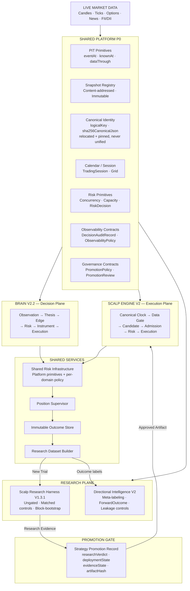
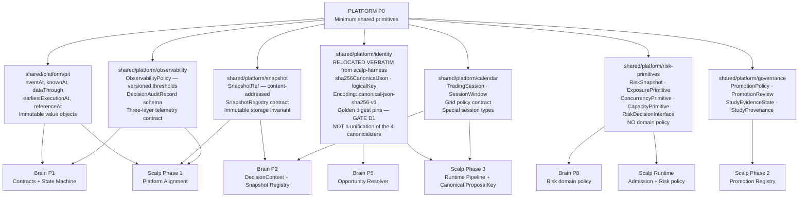
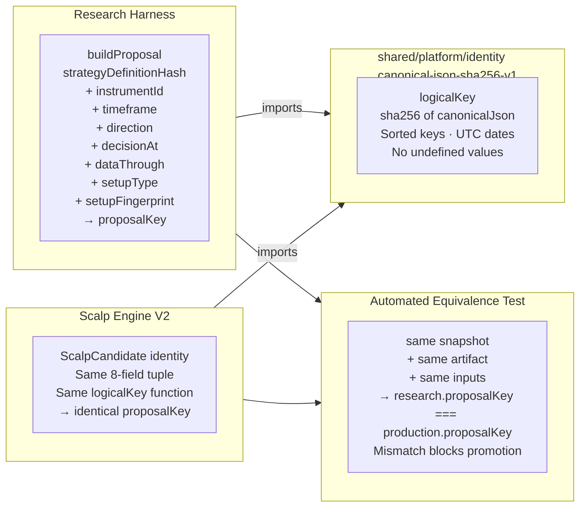
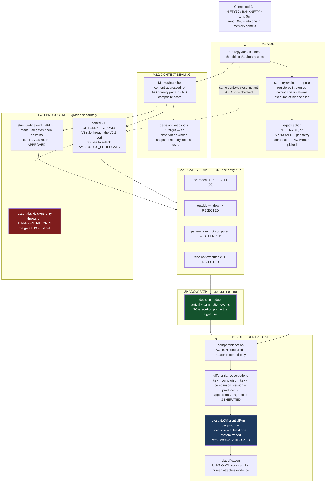

# Full Architecture: Pipeline Flow Diagrams

---

## 1. System Context: The Three Domains

---

## 2. Platform P0: Dependency Fan-out

---

## 3. Brain V2.2: Full Decision Pipeline

Each stage carries proof of all upstream approvals in its type. The compiler prevents calling a downstream stage without the upstream approval.

```mermaid
flowchart TD
    TICK["Market Tick\nsymbol · timeframe · livePrice"]

    subgraph CTX["CONTEXT SEALING — I11 I25 I26"]
        DC["BaseDecisionContext\ndecisionAt · snapshotRef\npolicyVersions · decisionKey\nHash of all inputs"]
    end

    subgraph PI["PATTERN INTELLIGENCE — I1 I2"]
        PO["PatternObservation\nobservationHash · dataVintageId\nearliestExecutionAt\nNO score · NO probability · NO return"]
        PLR["Pattern Ledger\nAppend-only · Optimistic concurrency\nexpectedVersion enforced"]
    end

    subgraph OR["OPPORTUNITY RESOLVER — I3"]
        OC["OpportunityCandidate\nDeterministic grouping by policy\nNO ranking · NO scoring\nIdentity = sha256 of observation set"]
        CA["CandidateApproved\nkind: CANDIDATE_APPROVED\ncarries: candidate + context"]
    end

    subgraph SI["STATE INTERPRETER"]
        MS["MarketStateInterpretation\nRegime · Direction evidence · Bias\nNO trade signal — observation only"]
        MA["MarketStateApproved\nkind: MARKET_STATE_APPROVED\ncarries: candidate + marketState + context"]
    end

    subgraph TB["THESIS BUILDER — I4 I18 I19"]
        TH["TradeThesis\ndirection · conviction · rationale\nNO ML probabilities · NO composite score\nBoth LONG and SHORT recorded\nrejected side seeds Candidate Dataset"]
        TA["ThesisApproved\nkind: THESIS_APPROVED\ncarries: thesis + candidate + marketState + context"]
    end

    subgraph EE["EDGE ENGINE — I5 I7 I17"]
        EA_D["Deterministic Baseline P7\nFixed policy · No ML\nFalsifiable edge measurement"]
        EA_ML["ML Edge P15 shadow only until P17\nMLProvenance attached\nmodelVersion · trainingCutoff\ntrainingDatasetRef · featureSetVersion"]
        EA["EdgeAssessment\nbaselineEdge · mlEdge optional\nEdgeApproved\nkind: EDGE_APPROVED\ncarries: thesis + edge + context"]
    end

    subgraph RK["RISK ENGINE — I5 I6 I22 I23"]
        RDC["RiskDecisionContext\nextends BaseDecisionContext\n+ portfolioRiskSnapshotRef sealed here"]
        RD["RiskDecision\npositionSize · stopPolicy · exposureCheck\nconcurrency gate · capacity gate\nvia shared/platform/risk-primitives"]
        RA["RiskApproved\nkind: RISK_APPROVED\ncarries: thesis + edge + risk + context + riskSnapshotRef"]
    end

    subgraph OP["OPTION POLICY — I7 I9 I19"]
        IDC["InstrumentDecisionContext\nextends RiskDecisionContext\n+ optionChainSnapshotRef sealed here"]
        ID["InstrumentDecision\nstrike · expiry · contractType\nNO thesis modification permitted"]
        IA["InstrumentApproved\nkind: INSTRUMENT_APPROVED\ncarries: thesis + edge + risk + instrument + context"]
    end

    subgraph EX["EXECUTION ENGINE — I8"]
        ED["ExecutionDecision\nentryPrice · orderType · timing\nNO instrument change permitted"]
        XA["ExecutionApproved\nkind: EXECUTION_APPROVED\nAll upstream proofs carried"]
    end

    subgraph PE["PAPER EXECUTOR"]
        PT["Paper Trade Created\nAll fields from ExecutionApproved\nFully replayable — I20"]
    end

    subgraph PS["POSITION SUPERVISOR — I9"]
        PM["Position Monitor\nMFE · MAE · trailing stop\nCircuit breakers: ExternalContext\n→ CircuitBreakerPolicy → PositionSupervisor"]
        PC["Position Close\nrealizedR · exitFillPrice\nobserved bid > mid — no fabrication"]
    end

    subgraph OT["OUTCOME ENGINE — P11"]
        OU["3-Layer Outcome\nUnderlying: did asset reach target?\nInstrument: did option capture the move?\nExecution: did fills erode P&L?"]
    end

    subgraph LED["DECISION LEDGER — I13 I15 I23 I24"]
        LE["append·aggregateId · expectedVersion · event\nOptimistic concurrency enforced\nAppend-only · Hash chain\neventId + decisionKey unique in persistence"]
    end

    TICK --> CTX
    DC --> PI
    PI --> PO
    PO --> PLR
    PLR --> OR
    OR --> OC --> CA
    CA --> SI
    SI --> MS --> MA
    MA --> TB
    TB --> TH --> TA
    TA --> EE
    EE --> EA_D
    EE --> EA_ML
    EA_D --> EA
    EA_ML --> EA
    EA --> RK
    RK --> RDC --> RD --> RA
    RA --> OP
    OP --> IDC --> ID --> IA
    IA --> EX
    EX --> ED --> XA
    XA --> PE --> PT
    PT --> PS
    PS --> PM --> PC
    PC --> OT --> OU

    CA --> LED
    TA --> LED
    EA --> LED
    RA --> LED
    IA --> LED
    XA --> LED
    PC --> LED
```

---

## 4. Brain V2.2: Invariant Enforcement Map

| Stage | Invariants Enforced | How |
| :--- | :--- | :--- |
| Pattern Intelligence | I1, I2 | No score/probability/return fields in `PatternObservation` type |
| Opportunity Resolver | I3 | No ranking function in type; deterministic grouping only |
| Context Sealing | I11, I25, I26 | `decisionKey` hash covers all inputs; no refresh after seal |
| Thesis Builder | I4, I18, I19 | No ML probability fields; no composite confidence; both directions recorded |
| Edge Engine | I5, I17, I28 | `MLProvenance` mandatory on ML path; deterministic baseline always runs |
| Risk Engine | I6, I22, I23 | Shared risk-primitives enforce concurrency/capacity; typed lineage IDs |
| Option Policy | I7 | Return type cannot modify `TradeThesis` — type system enforces |
| Execution Engine | I8 | Return type cannot modify `InstrumentDecision` — type system enforces |
| Position Supervisor | I9, I10, I27 | Cannot create new entries; outcomes flow to store, not back to decision path |
| Decision Ledger | I13, I15, I23, I24 | Optimistic concurrency; append-only; hash chain; unique IDs in persistence |
| ML Pipeline | I29 | Promotion gate required before paper authority; shadow phase mandatory |

---

## 5. Scalp Engine V2: Full Execution Pipeline

```mermaid
flowchart TD
    SCH["Scheduler Fires\nwall-clock: evaluationAt"]

    subgraph CLK["CANONICAL CLOCK RESOLUTION"]
        DT["decisionAt = canonical grid slot\ne.g. 09:16:00 IST\nschedulerLagMs = evaluationAt - decisionAt\nJitter is telemetry ONLY"]
    end

    subgraph ELG["RUNTIME ELIGIBILITY CHECK"]
        ART["Load Approved Strategy Artifact\nverify artifactHash before activation"]
        EL1["Check deploymentState\nSUSPENDED or RETIRED → INELIGIBLE"]
        EL2["Check expiresAt\nExpired → INELIGIBLE"]
        EL3["Dependency Compatibility\nRequired features present?\nGrid policy available?\nCost/settlement policy compatible?\nRisk policy compatible?\nNO silent fallback permitted"]
        INEL["INELIGIBLE → NO TRADE"]
    end

    subgraph PIT_S["SEALED PIT SNAPSHOT"]
        SS["Sealed DecisionContext\ndecisionAt · snapshotRef\nAll data fixed — no refresh\nI26: once sealed, no newer version permitted"]
    end

    subgraph DRG["DATA + FEATURE READY GATE"]
        TL["Tape Liveness Check — FIRST\nOHLC identical to previous bar?\nTAPE_LIVENESS_V1 · volume-blind\nTAPE_FROZEN → DEFERRED"]
        GA["Grid Alignment Check\ndecisionAt on GRID_POLICY_V1 lattice?\n09:15 IST + n×60s in 09:16–15:30"]
        FC["Feature Coverage Check\nFEATURE_WARMUP:ATR,EMA → DEFERRED\nFEATURE_LAYER_NOT_COMPUTED → DEFERRED\nSame taxonomy codes as research harness"]
        DR["DATA_READY\nTape live · all declared indicator requirements met\nsampleEligible = true"]
    end

    subgraph SR["STRATEGY RUNTIME"]
        PR["Load Strategy from Promoted Artifact\nstrategyDefinitionHash verified\nImplementationArtifactChecksum verified\nGrid policy from artifact metadata"]
        SC["ScalpCandidate produced\nproposalKey = logicalKey of\nstrategyDefinitionHash + instrumentId\n+ timeframe + direction + decisionAt\n+ dataThrough + setupType + setupFingerprint\nIdentical semantics to ImmutableStrategyProposal"]
    end

    subgraph ADM["TRADE ADMISSION"]
        AD["Admission Policy\nSession boundary check\nDuplicate detection via proposalKey\nidempotency enforced by persistence"]
    end

    subgraph RKE["COMMON RISK ENGINE"]
        RK["Domain Risk Policy\non shared/platform/risk-primitives\nConcurrency: position count gate\nCapacity: exposure gate\nWrite boundary enforcement"]
    end

    subgraph EXE["EXECUTION"]
        EX["Execution Policy\nEntry price resolution\nObserved pricing only\nbid > mid > null — no fabrication"]
    end

    subgraph POS["POSITION"]
        PO["Paper Position Created\nFully replayable\nAll fields from ExecutionApproved"]
    end

    subgraph PSV["POSITION SUPERVISOR"]
        PS["Monitor MFE · MAE\nTrailing stop policy\nCircuit breaker: external signal\n→ CircuitBreakerPolicy → PositionSupervisor\nNOT direct position mutation"]
        PCL["Position Close\nObserved exit price only"]
    end

    subgraph OUT_S["OUTCOME STORE"]
        O1["Underlying Outcome\nDid asset reach target?"]
        O2["Instrument Outcome\nDid option capture the move?"]
        O3["Execution Outcome\nDid fills and slippage erode P&L?"]
    end

    AUDT["DecisionAuditRecord emitted\nEvery tick — lightweight telemetry\nsnapshotResult · featureReadinessStatus\nstrategyEvaluationStatus · candidateCount\ncandidateIds · admissionResult\nriskResult · executionResult\nNo silent NO_ACTION"]

    SCH --> CLK
    CLK --> DT
    DT --> ELG
    ELG --> ART --> EL1 --> EL2 --> EL3
    EL3 -->|INELIGIBLE| INEL
    EL3 -->|ELIGIBLE| PIT_S
    PIT_S --> SS
    SS --> DRG
    DRG --> TL --> GA --> FC --> DR
    DR --> SR
    SR --> PR --> SC
    SC --> ADM --> AD
    AD --> RKE --> RK
    RK --> EXE --> EX
    EX --> POS --> PO
    PO --> PSV
    PSV --> PS --> PCL
    PCL --> OUT_S
    OUT_S --> O1
    OUT_S --> O2
    OUT_S --> O3

    DT --> AUDT
    DRG -.->|deferred| AUDT
    SR -.->|evaluated or skipped| AUDT
    ADM -.->|approved or rejected| AUDT
    RKE -.->|approved or rejected| AUDT
    EXE -.->|executed or no action| AUDT
```

---

## 6. Research → Promotion → Production Loop

```mermaid
flowchart TD
    subgraph MKT["LIVE MARKET DATA"]
        BAR["1m Candle Closes\n09:16 → 15:30 IST\nGRID_POLICY_V1 lattice"]
    end

    subgraph RH["SCALP RESEARCH HARNESS V1.3.1 — Ungated"]
        CAP["Capture Research Decision\nImmutableStrategyProposal\nstrategyDefinitionHash + proposalKey\nlegacyScoreGate.passed as COVARIATE\nnot a filter"]
        CTL["Matched Controls\n±15 min caliper · GRID_POLICY_V1\nBOTH LONG and SHORT\nsampleEligible gate\nTAPE_FROZEN vs FEATURE_WARMUP vs FEATURE_LAYER_NOT_COMPUTED\nMATCHED_CONTROL_POPULATION_V3\nGATE D4: cross-version pooling UNENFORCED"]
        SET["Settlement\nCanonical geometry + Native geometry\nTerminalOutcome per horizon\nMFE · MAE · rMultiple\nSettlementDefinitionHash bound"]
        EST["Estimation\nBlock-bootstrap\nTrading-day clustered\nSignal Edge · Execution Edge · Gate Value\nStudyEvidenceState tracks session count"]
    end

    subgraph EV["EVIDENCE REVIEW"]
        ES1["EARLY_DIAGNOSTIC\nsessions < 5\nNo candidacy trigger"]
        ES2["PROVISIONAL\n5–19 sessions\nNo candidacy trigger"]
        ES3["RESEARCH_USABLE\n20–59 sessions\nCandidacy triggered\nREVIEW_POLICY_V1: every 5 sessions"]
        ES4["STRONGER_VALIDATION\n60+ sessions\nEligible for PAPER"]
    end

    subgraph PG["PROMOTION GATE"]
        RV["Research Verdict\nSUPPORTED / REJECTED / INCONCLUSIVE"]
        HO["DATA_INSPECTED Check\nholdoutWindowStart > inspectedWindowEnd\nFresh untouched period required\nMore sessions alone not sufficient"]
        PR_REC["StrategyPromotionRecord sealed\nresearchDefinitionHash · artifactHash\nsignalEdgeRef · executionEdgeRef · gateValueRef\ncostPolicyVersion · gridPolicyVersion\nevidence state · sessionCount · studyProvenance\nresearchVerdict · deploymentState"]
        PP["PromotionPolicy V1\nRESEARCH → SHADOW: RESEARCH_USABLE + human sign-off\nSHADOW → PAPER: STRONGER_VALIDATION + human sign-off\nPAPER → PRODUCTION: differential test pass + human sign-off"]
    end

    subgraph TERM["TERMINAL STRATEGY REGISTRY — 7 entries, 3 statuses"]
        T1["index-v3-research\nSTATUS: TERMINAL — NO_VIABLE_HORIZON\nnever eligible · default DISABLED\ntwin: momentum-scalp-index"]
        T2["pattern-v4-research\nSTATUS: TERMINAL — degrades base strategy\nnever eligible · default DISABLED\ntwin: momentum-scalp-pattern-V2 (wraps V2 class)"]
        T3["momentum-v5-research\nSTATUS: RESEARCH · accruing\nthe ONLY entry that can unlock Tier 2\ntwin: momentum-scalp"]
        T4["pattern-v4-research-v2\nSTATUS: RESEARCH · generation 2\nparent pattern-v4 is TERMINAL\nno operational twin"]
        T5["index-v2-research\nSTATUS: SUPERSEDED\nscalp-raw-context-v1 · ZERO proposals\nnot evidence against the idea"]
        T6["momentum-v4-research\nSTATUS: SUPERSEDED\nscalp-raw-context-v1 · ZERO proposals"]
        T7["pattern-v3-research\nSTATUS: SUPERSEDED\nscalp-raw-context-v1 · ZERO proposals"]
    end

    subgraph OPREG["OPERATIONAL STRATEGY REGISTRY (production)"]
        OP1["momentum-scalp-index\nexecutableSides: SHORT only\nLONG disabled — 62 trades · -Rs 13,414"]
        OP2["momentum-scalp-pattern\nexecutableSides: SHORT only\nLONG disabled — 36 trades · -Rs 8,531"]
        OP3["momentum-scalp-pattern-v2\nexecutableSides: NONE — fully disabled\n3 trades vs a TERMINAL prior"]
        ACK["terminalResearchAcknowledgement\nnames research key · closureReason VERBATIM\ndisposition required even when disabled\nsilence FAILS the build"]
    end

    subgraph PROD["PRODUCTION RUNTIME"]
        SE["Scalp Engine V2\nconsumes approved artifact\nverifies artifactHash on activation"]
    end

    subgraph FEED["GOVERNED OUTCOME FEEDBACK"]
        OS["Immutable Outcome Store\nwrite-once · content-addressed"]
        RD["Research Dataset Builder\ncollects production outcomes\nas new research observations"]
        NTR["New Research Trial\nregistered with pre-specified study key\nbefore any result is seen"]
    end

    BAR --> RH
    RH --> CAP --> CTL --> SET --> EST --> EV
    EV --> ES1
    EV --> ES2
    EV --> ES3
    EV --> ES4
    ES3 --> PG
    ES4 --> PG
    PG --> RV --> HO --> PR_REC --> PP
    PP -->|REJECTED / TERMINAL| TERM
    TERM -->|"TERMINAL verdict MUST be acknowledged<br/>(Gap 13 — verified by test, never an import:<br/>research severance forbids the runtime edge)"| ACK
    ACK --> OP1
    ACK --> OP2
    ACK --> OP3
    PP -->|deploymentState advances| PROD
    PROD --> FEED
    FEED --> OS --> RD --> NTR --> RH

    style TERM fill:#fff3cd,stroke:#ffc107
    style OPREG fill:#f8d7da,stroke:#dc3545
    style ACK fill:#fff,stroke:#dc3545,stroke-width:2px
    style PROD fill:#d4edda,stroke:#28a745
```

---

## 7. Candidate Identity Equivalence: The Shared Bridge

---

## 8. Data Flow Summary: What Flows Where

| Data Object | Produced by | Consumed by | Immutable? |
| :--- | :--- | :--- | :--- |
| `PatternObservation` | Pattern Intelligence | Opportunity Resolver | ✅ Content-hashed |
| `BaseDecisionContext` | Context Sealer | All Brain stages | ✅ Sealed at creation |
| `TradeThesis` (both sides) | Thesis Builder | Edge Engine + Candidate Dataset | ✅ Carried in state type |
| `MLProvenance` | ML Edge Engine | Decision Ledger | ✅ All refs are SnapshotRefs |
| `RiskDecision` | Risk Engine | Instrument Policy | ✅ Point-in-time snapshot bound |
| `InstrumentDecision` | Option Policy | Execution Engine | ✅ Cannot be modified downstream |
| `ExecutionApproved` | Execution Engine | Paper Executor | ✅ All upstream proofs carried |
| `LedgerEvent` | All Brain stages | Ledger (append-only) | ✅ Hash chain, never updated |
| `ImmutableStrategyProposal` | Scalp Research Harness | Settlement, Estimation | ✅ `payloadHash` bound |
| `StrategyPromotionRecord` | Promotion Gate | Scalp Engine V2 | ✅ `artifactHash` verified on load |
| `ScalpCandidate` | Strategy Runtime | Trade Admission | ✅ `proposalKey` = canonical hash |
| `DecisionAuditRecord` | Every tick | Telemetry / Dashboards | Structured log (not ledger) |
| `OutcomeRecord` (3-layer) | Outcome Engine | Outcome Store | ✅ Append-only |
| `ResearchDataset` | Dataset Builder | Research Harness | Append-only |

---

## 9. V1 Retirement: The Differential Path

How P13's evidence is produced. This is the only path where V1 and V2.2 both decide, and it is
deliberately the only path where V2.2 cannot act.

**What the shape encodes**

- **One context, read once.** V1 and V2.2 both answer about the same object, which is what makes citing
  one snapshot ref for both sides of a comparison a fact rather than an assumption. The ported producer
  checks the sealed snapshot's close instant *and* close price against it, because a context re-read is
  enriched over time and a rebuild from the snapshot is thinner (`MarketSnapshot` drops
  `contextCandleIds` and pattern details).
- **Gates precede the entry rule for both producers.** V1 has none of them, so a frozen-tape bar
  produces a real divergence — `EXPECTED_ARCHITECTURAL_CHANGE`, with the D3 measurement attached.
- **`ported-v1` reaches `assertMayHoldAuthority`, never an execution port.** The shadow path needs no
  guard because it holds no such port; the guard exists for the path P19 will add.
- **The producer is part of the observation key.** Without it the two producers competed for one row and
  the second was silently dropped.

**Not on this diagram, because it does not exist yet:** divergence classification (every divergence
starts `UNKNOWN` and blocks), and P19 paper authority. Intraday timeframes are absent by measurement —
`trend-breakout` last proposed 2026-08-24.
