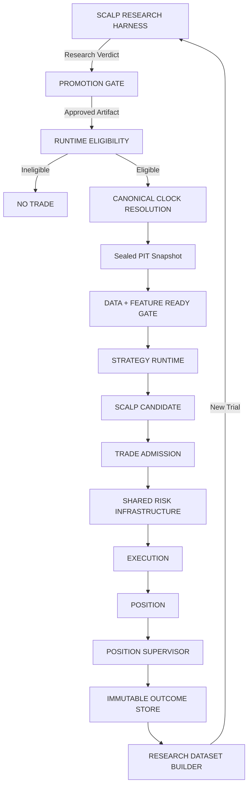

# Scalp Engine V2: Implementation Plan (Frozen Specification)

**Status:** SCALP ENGINE V2 — ARCHITECTURALLY FROZEN / PHASED (see Readiness Plan, The Tiered Programme)  
**Revision:** 2026-08-31 — corrections from a code-and-database verification pass

> [!NOTE]
> The architecture is unchanged. This revision corrects: the "Common Risk Engine" terminology, the
> Terminal Strategy Registry (which listed a class name and omitted the live generation-2 candidate),
> the canonical-identity instruction in Phase 1, the placement of the `DATA_INSPECTED` holdout fields,
> and adds the data-activity policy that `GRID_POLICY_V1` cannot express. Phase gating is now tiered:
> **Phase 2 waits for `RESEARCH_USABLE`; Phases 4–6 wait for a promoted artifact.**

## Goal Description

Transition the scalp trading system from the legacy `AutoBot-Classic` and `AutoBot-Sniper` implementations to **Scalp Engine V2**—a highly governed, strategy-agnostic production host for low-latency intraday/scalp strategies.

Production will strictly execute **promoted, immutable strategy artifacts** that have passed rigorous evaluation in the research plane, runtime eligibility checks, and dependency compatibility verification.

> **Crucial Implementation Note:** The legacy names "AutoBot Classic" and "AutoBot Sniper" are retired. The new mental model is a single **Scalp Engine** (the host runtime) running approved **Strategies** (the plugins/artifacts).

## Architectural Context

Three operational domains resting on shared platform infrastructure:

1. **Directional Intelligence V2:** Research and model plane.
2. **Brain V2.2:** Autonomous decision and orchestration plane.
3. **Scalp Engine V2:** Specialized execution plane for low-latency intraday/scalp strategies.

### Shared Platform Infrastructure
- PIT / Snapshot Registry (`eventAt`, `knownAt`, `dataThrough`, `earliestExecutionAt`, `referenceAt`)
- **Canonical Proposal Identity** (shared pure package — see Section 3)
- Trading Calendar & Session Windows
- **Shared Risk Infrastructure** (authoritative concurrency and capacity enforcement primitives; domain risk policy stays in the Scalp runtime — see Readiness Plan Gap 2)
- Execution Simulation, Position Supervision, Outcome Infrastructure, Replay Engine

## 1. Promotion & Governance Gate

Strategies evaluated in the Scalp Research Harness must meet predefined statistical thresholds. The promotion record stores **evidence**, not just approval.

```typescript
interface StrategyPromotionRecord {
  strategyId: string;
  strategyVersion: string;

  // From harness: researchDefinitionHash = strategyDefinitionHash
  // From harness: artifactHash = implementationArtifactChecksum
  researchDefinitionHash: string;
  artifactHash: string;
  researchHarnessVersion: string;

  signalEdgeRef: SnapshotRef;
  executionEdgeRef: SnapshotRef;
  gateValueRef: SnapshotRef;

  costPolicyVersion: string;
  settlementPolicyVersion: string;
  gridPolicyVersion: string;    // e.g. "GRID_POLICY_V1"

  validationWindow: { startAt: Instant; endAt: Instant; };

  // Evidence maturity — from harness StudyEvidenceState taxonomy
  // EARLY_DIAGNOSTIC < 5 sessions
  // PROVISIONAL      5–19 sessions
  // RESEARCH_USABLE  20–59 sessions   → minimum for SHADOW consideration
  // STRONGER_VALIDATION 60+ sessions  → minimum for PAPER / promotion review
  evidenceState: "EARLY_DIAGNOSTIC" | "PROVISIONAL" | "RESEARCH_USABLE" | "STRONGER_VALIDATION";
  sessionCount: number;

  // Provenance of parameter choices — from harness StudyProvenance taxonomy
  studyProvenance: "PRE_SPECIFIED" | "DATA_INSPECTED";

  // Separate research verdict from deployment intent
  researchVerdict: "SUPPORTED" | "REJECTED" | "INCONCLUSIVE";
  deploymentState: "RESEARCH" | "SHADOW" | "PAPER" | "PRODUCTION" | "SUSPENDED" | "RETIRED";

  approvedAt?: Instant;
  expiresAt?: Instant;
  promotionPolicyVersion: string;
}
```

### Governed Promotion Path

`SUPPORTED` is a **research verdict**, not a deployment state. These are two independent tracks connected by the promotion gate:

```
RESEARCH VERDICT (researchVerdict)    DEPLOYMENT LIFECYCLE (deploymentState)
────────────────────────────────      ─────────────────────────────────────
RESEARCH evidence accumulating        RESEARCH
         ↓                                    ↓
     SUPPORTED                          SHADOW          ← requires RESEARCH_USABLE
         ↓                                    ↓
  Promotion Review ─────────────────→  PAPER           ← requires STRONGER_VALIDATION
         ↓                                    ↓
     (or REJECTED / INCONCLUSIVE)       PRODUCTION      ← requires Promotion Review
```

A strategy can be `researchVerdict: SUPPORTED` while `deploymentState: RESEARCH` (evidence is there; deployment has not been authorized yet). The promotion gate is the explicit act that advances the deployment state.

### DATA_INSPECTED Provenance Rule

A `DATA_INSPECTED` strategy cannot use the inspected period as confirmation evidence. It requires a **fresh, untouched forward validation window** — not merely a larger session count. Promotion for such strategies explicitly cannot rely on inspected-period performance.

### Immutability Rule

Production must verify `artifactHash` before activation. If strategy code mutates, the version is terminal and a new artifact with a new research trial is required.

## 2. Terminal Strategy Registry

Strategies that have reached a terminal research state must be permanently recorded to prevent re-activation or in-place tuning.

> [!IMPORTANT]
> **The registry keys on `strategyKey`, never on an implementation class name.** The previous revision
> listed `PatternIntelligenceResearchAdapter`, which is a TypeScript class, not a strategy identity.
> The distinction becomes load-bearing once artifacts are hashed:
> `strategyKey` ≠ `implementationClass`.

| `strategyKey` | Sessions | Proposals | Research Status | Production Eligibility |
| :--- | ---: | ---: | :--- | :--- |
| `index-v3-research` | 5 | 318 | **TERMINAL** — horizon sweep returned `NO_VIABLE_HORIZON`; both width and holding period exhausted | Never eligible |
| `pattern-v4-research` | 5 | 1,327 | **TERMINAL** — degrades the base strategy monotonically on both deep ETFs | Never eligible |
| `momentum-v5-research` | 5 | 436 | `RESEARCH` — `PROVISIONAL`, evidence accumulating | Not yet eligible |
| `pattern-v4-research-v2` | 2 | 374 | `RESEARCH` — `EARLY_DIAGNOSTIC`, generation 2 | Not yet eligible |

*Counts measured 2026-08-31 against `research_scalp.proposals`.*

> [!IMPORTANT]
> **Implemented 2026-09-02 as `74e831d`, and the data corrected this table in two ways.**
>
> **It lists four strategies. There are seven.** `research_scalp.strategy_definitions` also holds
> `index-v2-research`, `momentum-v4-research` and `pattern-v3-research` — persisted definitions on the
> retired `scalp-raw-context-v1` feature schema, each with **zero captured proposals**. They were
> registered and then replaced when the schema moved to v2. Omitting them would have defeated the
> registry on its first real test: an unrecorded `strategyKey` that already exists in the database is
> exactly what someone could revive believing it was never tried.
>
> **They cannot be called TERMINAL, so a third status exists.** TERMINAL means the measured line of
> inquiry is closed, and every terminal entry carries a measured reason. Nothing was concluded about
> these three. `SUPERSEDED` says the true thing — *not eligible, not revivable under this key, and
> **not** evidence against the idea*. The distinction is load-bearing because these reason strings are
> read by people deciding whether to retry an idea.
>
> | `strategyKey` | Research Status | Production Eligibility | Operational twin |
> | :--- | :--- | :--- | :--- |
> | `index-v3-research` | **TERMINAL** | Never eligible | `momentum-scalp-index` |
> | `pattern-v4-research` | **TERMINAL** | Never eligible | `momentum-scalp-pattern-v2` |
> | `momentum-v5-research` | `RESEARCH` | Not yet eligible | `momentum-scalp` |
> | `pattern-v4-research-v2` | `RESEARCH` | Not yet eligible | — (its own adapter) |
> | `index-v2-research` | `SUPERSEDED` | Never eligible | — (implementation gone) |
> | `momentum-v4-research` | `SUPERSEDED` | Never eligible | — (implementation gone) |
> | `pattern-v3-research` | `SUPERSEDED` | Never eligible | — (implementation gone) |
>
> **The operational twin is derived from which class each adapter wraps, never from name similarity.**
> `pattern-v4-research` wraps `MomentumScalpPatternStrategyV2`, so its twin is the operational **v2**
> key despite the research key reading as generation 1. That mapping is what made the propagation gap
> findable — see the readiness plan's *Gap 13*, where both TERMINAL entries turned out to have live
> production twins with nothing connecting the records.
>
> **Enforcement is mechanical, not asked for in prose.** The verbatim-parent-reason rule below is
> string-compared, so "degrades the base strategy monotonically on both deep ETFs" cannot decay into
> "underperformed" — which reads like a tuning problem. A per-entry definition-hash pin catches
> in-place tuning that source-file checksums miss: editing a `configuration` override leaves every
> checksum intact while redefining what the accumulating cohort measures.
>
> **Session counts are deliberately absent from the code.** They were 5 when this table was written
> and 7 by 2026-09-02; a count in source is wrong the next trading day. Status and reason live in the
> registry, counts live in a document with a measurement date, or in a query.
>
> Note for planning: `index-v3-research` and `pattern-v4-research` will both accrue to 20 sessions and
> **still never be eligible**. Only `momentum-v5-research` reaching `RESEARCH_USABLE` unlocks Tier 2.

> "Terminal" means the measured line of inquiry is closed, not that the idea should be retuned under the same version. Any renewed attempt must become a new artifact with a new `researchVersion` and a new research trial.

### Generation Lineage Must Be Explicit

`pattern-v4-research-v2` is a legitimate second-generation attempt under the versioning rule above,
but its lineage has to be machine-readable or the research history will be misread as a fresh idea
rather than a retry of a closed line:

```
pattern-v4-research
        ↓  TERMINAL — degrades base strategy
pattern-v4-research-v2
        ↓  NEW EXPERIMENT, new hash, new trial
```

```typescript
interface StrategyLineage {
  strategyKey: string;
  parentStrategyKey?: string;
  parentStrategyVersion?: string;
  parentTerminalReason?: string;   // carried forward verbatim, never paraphrased
}
```

The prior on generation 2 is strongly negative and the registry should say so, not stay silent.

### Terminal Strategies Default to Disabled

> [!NOTE]
> **Implemented, and both terminal strategies are currently opted in as benchmarks** — so capture
> behaviour is unchanged by the registry landing. Deliberate: disabling removes 1,135 of 1,881
> opportunities (60%) and rehashes the 137 `momentum-v5-research` opportunities co-membered with a
> terminal proposer, which §2 requires to happen on a recorded session boundary. A registry that
> did that on the day it shipped would be indistinguishable from a regression.
> 
> The runner reports the selection **by name, once per session** rather than through the per-minute
> result — every field on that result is summed across a session's minutes, so "2 disabled" would
> have reported as 750. It also means "proposals fell 60%" and "the terminals were withheld" are
> distinguishable in the log instead of identical.

Both terminal strategies are still running: 1,645 proposals across the last five sessions. Benchmark
value is real, but it should be opt-in rather than a standing cost.

```
TERMINAL  →  default DISABLED

normal research capture   → active candidates only
benchmark capture         → benchmarkMode = true, explicit per strategy
```

> [!WARNING]
> **Disabling is not measurement-neutral, and the reason is non-obvious.** `resolveOpportunities`
> groups proposals by `(instrumentId, sessionId, direction, decisionAt, groupingPolicyVersion,
> referencePolicyVersion)` — it is **strategy-agnostic** — so proposals from different strategies at
> the same decision instant share one opportunity, and `payloadHash` covers `proposalIds`.
>
> Measured 2026-08-31:
>
> | Effect | Count |
> | :--- | ---: |
> | Opportunities whose sole proposer is a terminal strategy — these disappear | 1,135 of 1,881 (60%) |
> | `momentum-v5-research` opportunities co-membered with a terminal strategy | 137 of 436 (31%) |
>
> The 60% capacity saving is real. What the 137 lose is `proposalIds`, `payloadHash` and
> `opportunity_memberships` rows — **not** canonical geometry or decision times, because
> `resolveOpportunities` throws unless every member agrees on `referenceCandleId`, `referencePrice`
> and `dataThrough`. So momentum-v5's economic measurements are unaffected.
>
> Consequence: disable on a **recorded session boundary**, never mid-session, and expect a step in
> opportunity payload hashes across it.

## 3. Canonical Proposal Identity (Shared Platform Package)

The invariant `RESEARCH CANDIDATE = PRODUCTION CANDIDATE` requires both sides to derive candidate identity from the same specification. Production must not import `logicalKey()` from the research package (that would violate the physical severance boundary). Instead, extract it into a shared, pure platform package:

```
shared/scalp-identity/
    proposal-identity.ts    ← pure function, no research/production deps
```

Both the Research Harness and Scalp Engine V2 import from this shared package.

The canonical identity fields are (verified from [`contracts.ts`](file:///c:/Users/Kulwinder%20Singh/Desktop/personal/AI%20Quant%20Lab/apps/api/src/modules/research/scalp-harness/domain/contracts.ts) `buildProposal()`):

```
strategyDefinitionHash
+ instrumentId
+ timeframe
+ direction
+ decisionAt
+ dataThrough
+ setupType
+ setupFingerprint
→ proposalKey (sha256 of canonicalJson envelope)
```

The encoding standard is `canonical-json-sha256-v1` (sorted object keys, UTC dates, no undefined). A production candidate producing a different `proposalKey` from the same inputs fails the automated equivalence test and blocks promotion.

## 4. Strategy Grid Policy (Artifact Metadata)

`GRID_POLICY_V1` is the current 1-minute lattice (09:15 IST + n × 60s). To keep Scalp Engine V2 strategy-agnostic, the grid is declared as **artifact metadata**, not hardcoded into the host:

```typescript
interface StrategyGridPolicy {
  gridVersion: string;           // e.g. "GRID_POLICY_V1"
  anchorIstMinute: number;       // 09:15 = 555
  intervalSeconds: number;       // 60
  sessionOpenIstMinute: number;  // 556 (first valid decision: 09:16)
  sessionCloseIstMinute: number; // 930 (15:30)
}
```

A future strategy on a 5-minute grid declares its own policy version. The production host consumes whatever the artifact declares.

### The Grid Does Not Answer Data Freshness

`GRID_POLICY_V1` admits `(09:15, 15:30]`, and from 2026-08-03 the index feed freezes daily from the
15:16 bar to the close — publishing bars on time, correctly stamped, each repeating the last real
print. Measured 2026-08-31 on NIFTY50 1m: pinned at 24050.25 with all four OHLC values identical from
15:15 to 15:28, then a genuine close at 15:29.

Two policies, deliberately separate:

```
GRID_POLICY_V1        = temporal eligibility     (which slots are decision slots)
TAPE_LIVENESS_V1      = information freshness    (whether the slot carries an observation)
```

Redefining the grid to solve a data-quality problem was considered and **rejected on evidence**:
truncating to 15:15 discards the genuine 15:29 closing print every session, encodes a vendor defect
into a domain policy, and orphans `GRID_POLICY_V1`, which is pinned into 9,218 terminal settlements.

```typescript
interface StrategyDataActivityPolicy {
  tapeLivenessPolicyVersion: string;   // e.g. "TAPE_LIVENESS_V1"
  identicalBarThreshold: number;       // consecutive OHLC-identical bars meaning frozen
}
```

> [!CAUTION]
> **The test is value repetition and must be volume-blind.** Do not include zero volume as the test or
> as a conjunct. Index volume is a constituent aggregate, so it keeps accumulating while the price
> aggregate is frozen — volume across the frozen window on 2026-08-31 runs
> `0, 0, 0, 0, 125,958,451, 2.8M, 3.7M, 4.4M, 5.6M, 6.4M, 5.0M, 2.7M, 5.3M`. A volume conjunct turns a
> 13-bar detection into a 4-bar detection; this is the defect already observed in
> `pattern-intelligence/domain/bar-integrity.ts`.

Threshold calibration — consecutive OHLC-identical 1m bars, both indices, 21 days: healthy
09:16–15:15 gives 10,800 runs with a longest run of **1**; the frozen window gives 72 runs with a
longest run of **13**. Two separates them with no observed false positive. The threshold is declared
per instrument and versioned, because an illiquid single stock can legitimately repeat a minute.

**Status:** implemented for the research harness as `5a3d596` (`controlPolicyVersion` V2 → V3).
Outstanding: the per-instrument declared threshold, and `isStaleBar` in Pattern Intelligence.

## 5. Hard Invariants & Core Boundaries

- **RESEARCH CANDIDATE = PRODUCTION CANDIDATE:** Enforced by automated test — same snapshot + same artifact + same input must produce identical `proposalKey`.
- **FEATURE_NOT_COMPUTED ≠ FEATURE_COMPUTED_NO_SIGNAL:** The harness distinguishes `FEATURE_WARMUP:ATR,EMA` from `FEATURE_LAYER_NOT_COMPUTED`. Production must use the **same taxonomy codes**, not new ones.
- **DATA PRESENT ≠ DATA DECISION-READY:** A timestamp-valid sample is not decision-ready unless the
  underlying data carries sufficient fresh market information under the instrument's declared
  data-activity policy. There are three data states, not two — *not available*, *present but not yet
  computed*, and *present but economically frozen* — and the third passes every clock-based check.
- **No silent dependency fallback:** A promoted artifact may only execute when all declared feature versions, grid policy, and cost/settlement policy are present and version-compatible.
- **RESEARCH:** Cannot execute.
- **PRODUCTION:** Cannot import research internals (`ResearchEstimator`, `ControlMatcher`, `BootstrapEstimator`). The artifact is the only bridge. This is already enforced by the transitive import-graph test in `scalp-research-isolation.test.ts`.
- **OUTCOME:** Cannot modify current production (Brain I27). Outcome flows to `Immutable Outcome Store` → `Research Dataset Builder` → `Research Harness`. Never directly back to a running strategy.

## 6. Scalp Engine V2 Pipeline



### Stage Notes

**Runtime Eligibility** checks: artifact `expiresAt`, `deploymentState` (`SUSPENDED`, `RETIRED`), declared feature/grid/cost/risk policy compatibility. A strategy with any unresolvable dependency is `INELIGIBLE` and produces no trade.

**Canonical Clock Resolution** separates scheduler invocation time from decision time:
- `decisionAt` = canonical grid slot (e.g., 09:16:00)
- `evaluationAt` = wall-clock moment the scheduler woke (e.g., 09:16:08)
- `schedulerLagMs` = telemetry (8000ms)

Scheduler jitter never alters `decisionAt`. An off-grid wall-clock tick resolves to the correct grid slot. Replay is deterministic because `decisionAt` is always the grid-anchored value.

**Data + Feature Ready Gate** evaluates (in order):
1. **Tape liveness** — did this bar repeat its predecessor? A frozen bar is not an observation at all,
   which outranks every question below it. → `DEFERRED: TAPE_FROZEN`
2. Grid alignment of resolved `decisionAt`
3. Feature warmup coverage (using same codes as harness: `FEATURE_WARMUP:*`, `FEATURE_LAYER_NOT_COMPUTED`)
4. Data freshness against the artifact's declared `StrategyGridPolicy`

Missing coverage → `DEFERRED: FEATURE_LAYER_NOT_COMPUTED` (pipeline defect, not strategy outcome).

Tape liveness is ordered first on principle: a bar that never moved has no features to be missing, so
reporting a warmup gap on it would name the less fundamental of two problems. The two do not co-occur
in the observed data — the freeze runs six hours after warmup completes — but the order must be fixed
because the gate returns a single reason and it has to be deterministic for replay.

## Implementation Phases

### Phase 1: Shared Platform
- **Relocate** the `canonical-json-sha256-v1` identity implementation verbatim into the shared
  platform identity package, with golden digest pins. Do **not** re-implement or "unify" it: two
  functions named `sha256Canonical` already exist in this repository with different byte semantics,
  and 9,218 terminal settlements plus 180 study trials depend on the current digests. See Readiness
  Plan **Gap 1a / D1**.
- Integrate with the shared PIT Platform and Shared Risk Infrastructure.

### Phase 2: Promotion Registry

> Tier 2. Start when `momentum-v5-research` reaches `RESEARCH_USABLE`. As of 2026-08-31 it holds
> 5 sessions and is `PROVISIONAL`.

- Implement `StrategyPromotionRecord` with `evidenceState`, `sessionCount`, `studyProvenance`, `gridPolicyVersion`, `tapeLivenessPolicyVersion`.
- **Add the `DATA_INSPECTED` holdout fields here** (`inspectedWindowEnd`, `holdoutWindowStart`). This
  was previously listed as a pre-coding checklist item, which deadlocked: the type it modifies is
  created in this phase. It is now part of this phase's definition of done.
- Read evidence-state boundaries from `StudyEvidencePolicy` and record `evidencePolicyVersion`. Do not
  copy the `5 / 20 / 60` literals — `decisionGradeSessionMinimum` already owns the 20.
- Implement `Runtime Eligibility Check` including dependency compatibility verification.
- Implement the Terminal Strategy Registry (Section 2).

### Phase 3: V2 Runtime Pipeline & Contracts
- Implement state-machine: `Canonical Clock` → `Sealed PIT` → `Data Ready Gate` → `Candidate` → `Admission` → `Risk` → `Execution`.
- Automated equivalence test: `research.candidate(snapshot) === production.candidate(snapshot)`.

### Phase 4: Strategy Host
- Build Scalp Engine V2 as strategy-agnostic. **WAIT FOR APPROVED ARTIFACT.** Do not deploy any strategy until it emerges from the frozen research harness via the promotion gate.

### Phase 5: Replay & Differential Testing
- Run Scalp V2 replay against legacy AutoBot logs.
- Classify all divergences (`EXPECTED_ARCHITECTURAL_CHANGE`, `DATA_DIFFERENCE`, `POLICY_DIFFERENCE`, `RISK_DIFFERENCE`, `EXECUTION_DIFFERENCE`, `BUG`, `UNKNOWN`). `UNKNOWN` and `BUG` block promotion.

### Phase 6: Production Cutover
- Formally deprecate and quarantine `AutoBot-Classic` and `AutoBot-Sniper`.

## Implementation Cautions & Safeguards

> [!CAUTION]
> The following rules govern the implementation phase to prevent the architecture from degrading during construction.

1. **Governed Promotion Path:** `SUPPORTED` is a research verdict; `SHADOW`/`PAPER`/`PRODUCTION` are deployment states. They advance independently through the promotion gate. Research verdict: `RESEARCH → SUPPORTED / INCONCLUSIVE / REJECTED`. Deployment lifecycle: `RESEARCH → SHADOW → PAPER → PRODUCTION` (also `SUSPENDED`, `RETIRED`). A strategy may be `researchVerdict: SUPPORTED` and `deploymentState: RESEARCH` — promotion is the explicit act that advances deployment.
2. **DATA_INSPECTED strategies require a fresh holdout window** — not just more sessions. The inspected period cannot serve as confirmation evidence.
3. **Automated Candidate Equivalence Test:** `proposalKey` mismatch between research and production on identical inputs is a hard promotion blocker.
4. **No silent dependency fallback:** Any unresolvable feature, grid, or policy dependency produces `INELIGIBLE`, never a degraded execution.
5. **Permanent Strategy Version Death:** A `REJECTED` or `TERMINAL` strategy version is never "fixed in place." A new tuning becomes a new artifact with a new research trial.
6. **Scheduler jitter does not alter `decisionAt`:** The canonical grid slot is always the decision timestamp. Wall-clock invocation time is telemetry only.
